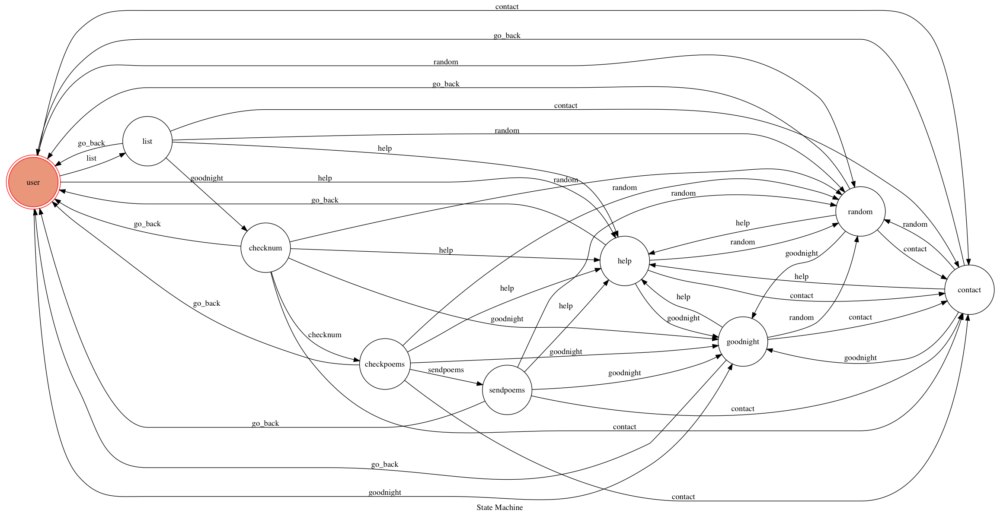

# Goodnight-cat telegram bot

A telegram bot based on a finite state machine.
Send you the latest post of goodnight poem on facebook.

## Setup

### Prerequisite
* Python 3

#### Install Dependency
```sh
pip install -r requirements.txt
```

* pygraphviz (For visualizing Finite State Machine)
    * [Setup pygraphviz on Ubuntu](http://www.jianshu.com/p/a3da7ecc5303)

### Secret Data

`TELEGRAM_API_TOKEN`, `WEBHOOK_URL` and `FACEBOOK_TOKEN` in app.py **MUST** be set to proper values.
Otherwise, you might not be able to run your code.

### Run Locally
You can either setup https server or using `ngrok` as a proxy.

**`ngrok` would be used in the following instruction**

```sh
ngrok http 5000
```

After that, `ngrok` would generate a https URL.

You should set `WEBHOOK_URL` (in app.py) to `your-https-URL/hook`.

#### Run the sever

```sh
python3 app.py
```

## Finite State Machine


## Usage
The initial state is set to `user`.

Every time `user` state is triggered to `help`, `contact`, `random`, `goodnight` state, it will `go_back` to `user` state after the bot replies corresponding message.

When `list` state is triggered, user could follow the prompt keyboard to get the list of poems.

* user
	* Input: "/start"
		* Reply: "嗨，我是晚安貓，我是喜歡讀晚安詩的一隻貓🐱"、"睡前和我說一聲晚安，我會很開心得和你分享一首最新的晚安詩呦！"

	* Input: "晚安"
		* Reply: the latest post of goodnight poem（[晚安詩](https://www.facebook.com/goodnightpoem/)） on facebook.

	* Input: "/help"
		* Reply: "和我說「晚安」，讀一首詩給你。"、"其他功能： 1. /random: 再讀一首不一樣的詩  2. /list: 讀很多首詩  3. /contact: 看看作者的資訊，並留言給作者"

	* Input: "/contact"
		* Reply: "想和作者說什麼嗎？"、"傳封訊息吧：https://t.me/ching56"

	* Input: "/random"
		* Reply: "給你一首我喜歡的詩，喵"、and randomly reply a poem on the first page of goodnight poem.

	* Input: "/list"
		* Reply: "想要這麼多詩呀，可以和我說聲晚安嗎？"
		* Input: "晚安"
		* Reply: "共有 {num of poems on the first page of goodnight poem} 首詩，等我一下～"
		* Input: "沒關係，但別睡著了呀！"
		* Reply: "這裡有: {authors} 的詩，你有興趣嗎？"
		* Input: "我有興趣，請通通給我吧。"
		* Reply: all poems on the first page of goodnight poem

## Author
[Ching li](https://github.com/ching56/)
[Lee-W](https://github.com/Lee-W)
